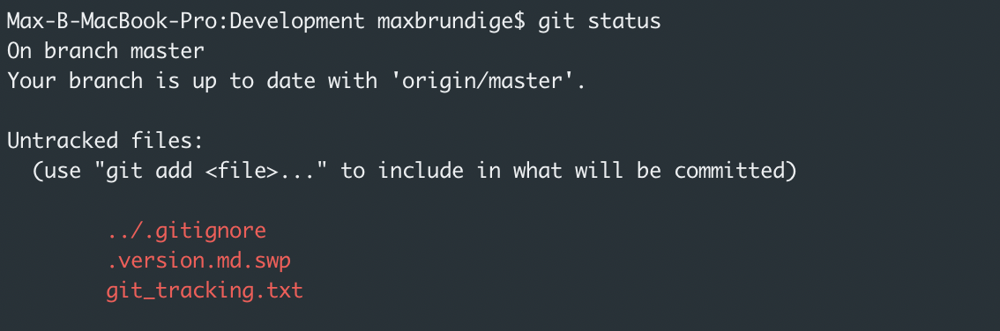

# Version Control

## What is the preferred tool of choice?
Git. There are distributed version control systems out there, but git has a much larger adoption and integrates with almost any form of project management software like JIRA.

## What is git?
Git is a database that houses configurations and data (in the form of file snapshots)

## Where can git live?
Git can be run locally and remotely. Locally means that only your computer will have access to the git repository. Remotely means that others permissably can access the repository. In mostcases, you will be working with the latter because git gains power by being distributed amongst many different computers. Git takes snapshots of your files once you make and commit your changes. 

### The primary advantage of git (example)
User A makes a change and commits it to the shared repository (hosted in Bitbucket or Github) and User B clones it their computer. Now User B has a full copy of all of the previous versions locally on their machine. Why is this important? Well, if User A has damage to their computer and loses their files, now User B has a backup. But what if User A and User B have damage at the same time? That is when using a hosting product like Bitbucket or GitHub to diaster recovery scenarios as such.  

## How does Git work?
Before we jump into installing, initializing, and further using git, it is important to first understand how git manages files. Git uses files states as a way to track where files are at in their lifecycles. 

When a user creates a brand new file in the working directory, the file is not yet being tracked by git. In this case, I have created a file called "git tracking". Below you can see that git tracking is in the "Untracked files" bucket:

You will also see some other Untracked files. We will talk about one in particular, .gitignore, later in this section. For now, let's keeping rolling with this example and say that we need to start tracking versioning on "git_tracking.text" 

### The Three States:
1. Committed: snapshot/data is safely stored
2. Modified: changing the file, but not committed the database yet
3. Staged: you have marked a modified files in its current state to got to the next commit snapshit

That leads us the the three different components of a git project
* .git directory which is the repository of snapshots
* working directory which is a single checkout of one version of the project
* staging is where files with changes live until they are committed to the .git directory

.git Directory

The .git directory houses metadata (e.g., configs, info) and object database for your project. When you do a:
~~~
git clone
~~~
this gets copied from the remote source

#### Working Directory
The working directory contains files from the .git directory that have been placed on disk for use and modify and then also houses newly added files

#### Staging Area
The file has been marked as a changed file, bu had not yet been committed to your database yet

### Staged
The file is marked as modified and will go into your next commit snapshot

~~~
Before we talk about installing git, I would recommend that we 
~~~

## Installing Git

Other content to add
* Creating a repo versus cloning
* Commit messages
* .gitignore
* Logs
* diffs

